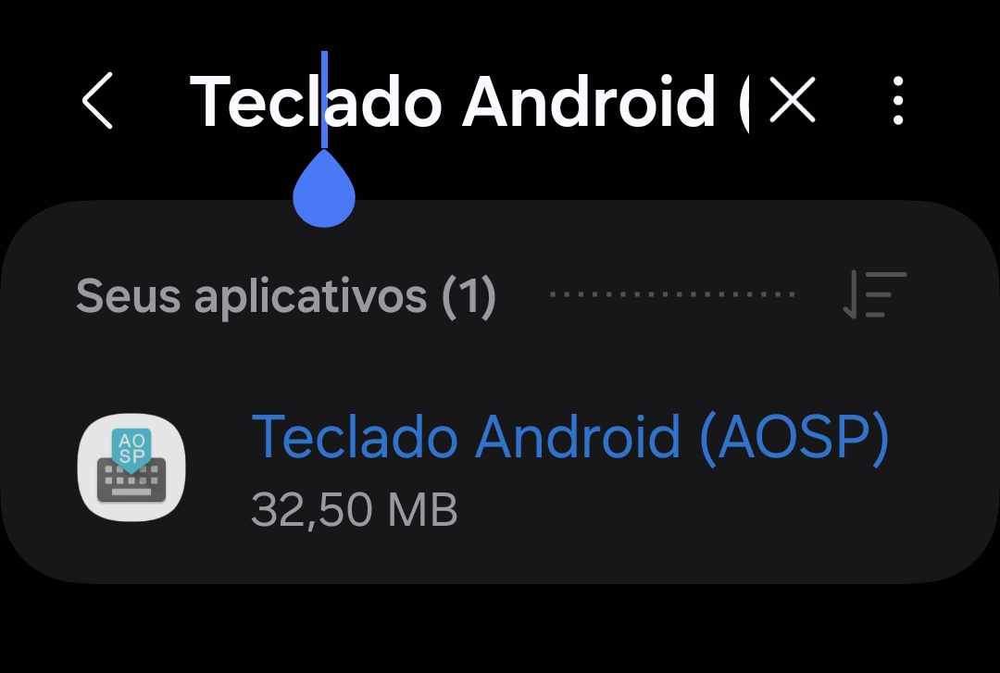
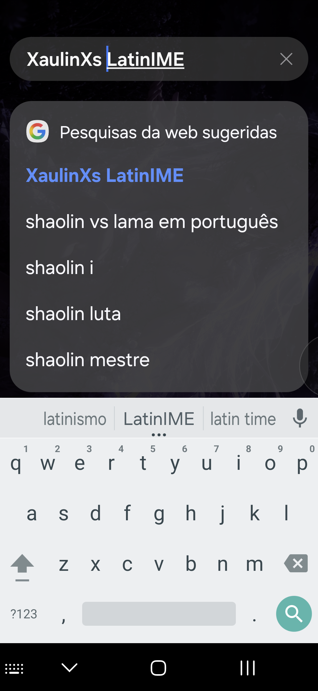

<div align="center">

# ⌨️ XaulinXs LatinIME

### O Teclado Android Diretamente do AOSP na Palma da Sua Mão — Sem Complicações

**Sem Android Studio. Sem compilar o AOSP inteiro.**
**Apenas GitHub Actions + Workflows, Gradle Moderno e AGP Atualizado.**

<p align="center">
  
</p>


</div>

---

## 🚀 Por que este projeto existe

O **LatinIME** é um dos aplicativos mais icônicos do Android — o teclado oficial do **Android Open Source Project**, usado como base por praticamente todas as ROMs e distribuições Android existentes.

O problema é que, com o passar dos anos, compilar o LatinIME fora do ambiente interno do Google se tornou cada vez mais difícil: scripts de build legados, dependências obsoletas, `Android.mk` quebrado e a exigência de baixar a árvore completa do AOSP (dezenas de GB) afastaram desenvolvedores e entusiastas do projeto.

Muitos forks por aí resolvem isso da forma errada: **removem o Material Design original do Google** e entregam um teclado descaracterizado, ou simplesmente publicam código-fonte que só compila dentro do Android Studio, sem nunca disponibilizar uma build pronta.

O **XaulinXs LatinIME** nasce para resolver isso de verdade:

> Modernizar o sistema de build do teclado oficial do AOSP, permitindo gerar APKs diretamente pelo **GitHub Actions**, com **Gradle** e **Android Gradle Plugin** atualizados — sem depender da compilação completa do AOSP, sem Android Studio, e **preservando o visual Material original do Google**.

Basta ir até a aba **Actions**, rodar o workflow, e o APK funcional sai pronto.

---

## ✨ Destaques

- ✅ Código-fonte original do **LatinIME (AOSP 14)**
- ✅ 100% compilável via **GitHub Actions + Workflow** (um clique e pronto)
- ✅ **Gradle moderno** + **Android Gradle Plugin** atualizado
- ✅ **Não precisa** baixar a árvore completa do AOSP
- ✅ **Não precisa** de Android Studio
- ✅ Mantém o **Material Design original do Google** — o que a maioria dos forks remove
- ✅ Recursos de design adicionais, sem descaracterizar o teclado
- ✅ Engine nativa em C++ para o dicionário, com build via CMake
- ✅ Compatível com Android 9 até Android 14
- ✅ Aberto para estudo, modificação e engenharia reversa

---

## 📷 Demonstração

<p align="center">
  
</p>

<p align="center">
  
  &nbsp;&nbsp;&nbsp;
  
</p>

---

## 🏗 Estrutura do Projeto

```
common/
java/
native/
dictionaries/
tests/
assets/
demonstre/
.github/
```

---

## ⚡ Sistema de Build Modernizado

| Componente             | Status |
|-------------------------|:------:|
| Gradle moderno           | ✅ |
| Android Gradle Plugin    | ✅ |
| GitHub Actions (CI)      | ✅ |
| Wrapper atualizado       | ✅ |
| CMake (build nativo)     | ✅ |
| Compatibilidade de SDK   | ✅ |

---

## 📦 Como compilar

### Opção 1 — GitHub Actions (recomendado, sem PC)

1. Acesse a aba **Actions** deste repositório
2. Selecione o workflow de build
3. Clique em **Run workflow**
4. Baixe o APK gerado nos **Artifacts** ao final da execução

### Opção 2 — Local via Gradle

```bash
git clone https://github.com/Saulo5810p/XaulinXs-LatinIME.git
cd XaulinXs-LatinIME
./gradlew assembleDebug
```

---

## 🎯 Compatibilidade

| Android    | Suporte |
|------------|:-------:|
| Android 9  | ✅ |
| Android 10 | ✅ |
| Android 11 | ✅ |
| Android 12 | ✅ |
| Android 13 | ✅ |
| Android 14 | ✅ |

---

## ❤️ Para quem é este projeto

- Desenvolvedores de ROM
- Estudantes e entusiastas de Android
- Contribuidores do AOSP
- Pessoas que sentem falta do LatinIME original, sem cortes de recursos
- Qualquer um que queira um teclado AOSP funcional sem montar um ambiente de compilação gigante

---

## 🎯 Objetivos do Projeto

- Preservar a implementação original do AOSP
- Modernizar a infraestrutura de build
- Manter o projeto simples de compilar
- Garantir compatibilidade com versões recentes do Android
- Servir de base limpa para melhorias futuras

---

## 📚 Créditos

- Android Open Source Project
- Google
- Todos os contribuidores que mantiveram o LatinIME vivo ao longo da história do Android

---

## 📄 Licença

Apache License 2.0

O código-fonte original pertence ao Android Open Source Project. Este repositório apenas moderniza a infraestrutura de build e disponibiliza uma forma prática de compilar o projeto original.

---

<div align="center">

### ⭐ Se este projeto te ajudou, considere deixar uma estrela!

**Trazendo o teclado original do AOSP de volta, pronto para compilar.**

</div>
